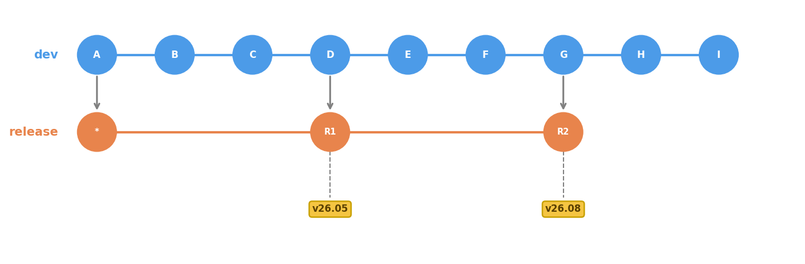
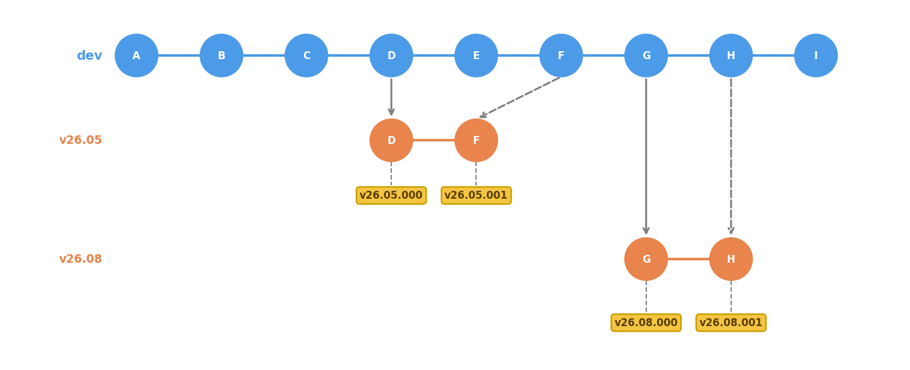

# OpenUSD Release Branches

Copyright &copy; 2026, Pixar Animation Studios, version 1.0

## Background

The OpenUSD GitHub repository currently uses two branches, `dev` and `release`.
The tip of the `release` branch always points to the newest OpenUSD release,
and tags are used to designate specific release versions (e.g. `v26.05` and
`v26.08`).

When a release is published, the contents of the `dev` branch are merged into
`release` and tagged with the release's version number. This process means the
`dev` branch must only contain commits that are intended for the upcoming
release. Because of this, during the testing/release candidate period for a
release, changes intended for the next release cannot be published to the
`dev` branch. This has caused friction between developers at Pixar and other
contributors when collaborating on projects, since changes made internally
at Pixar aren't available externally until after the release period.

## Proposal

Under this proposal, each non-patch OpenUSD version will have its own branch in
the repository. Tags will be used on version branches to designate specific
patch releases (including the initial release), while the tip of each version
branch will always point to the latest patch release. The names of the version
branches will follow the pattern `vYY.MM`, and the tags will be named
`vYY.MM.PATCH` matching OpenUSD's versioning scheme. For the initial release,
the patch version is set to 0. We will use three digits for the patch version,
allowing for up to 999 patches to a release, which should be more than enough.

In this diagram, both the `v26.05` and `v26.08` branches have two tags
indicating releases for those versions: the `.000` tag for the initial release
and a `.001` tag indicating a patch release containing a cherry-picked change
from `dev`.

This change in structure will be applied beginning with the next release
(tentatively `v26.11`). Branches will _not_ be created for previous releases.
The existing `release` branch will be deprecated and removed from the repository
in the subsequent release to avoid confusion. Removing this branch will _not_
remove it from other clones and forks automatically. The currently-existing
version tags will also continue to work even after the branch is removed. Note
that this means there will be no static label in the GitHub repository that
always represents the latest OpenUSD release.

At the start of the testing period for a release, a new branch for the upcoming
version will be created. QA testing will occur on this branch, while development
will continue as normal on the `dev` branch. If there are any changes that need
to be included in the release after the branch is created, those changes will
land in the `dev` branch first, then be cherry-picked to the release branch.
When the release is ready, the tip of the release branch will be tagged with
the appropriate version number and published as an official release.

This new structure solves the main problem of allowing continued development
in the `dev` branch during the release process. It also makes it easier to
create and manage patch releases, which sets the foundation for potentially
applying security and other patches to releases on a more regular basis.
Using branches instead of tags allows pull requests to be filed against
those branches, which would potentially allow external partners to help manage
those patch releases.
